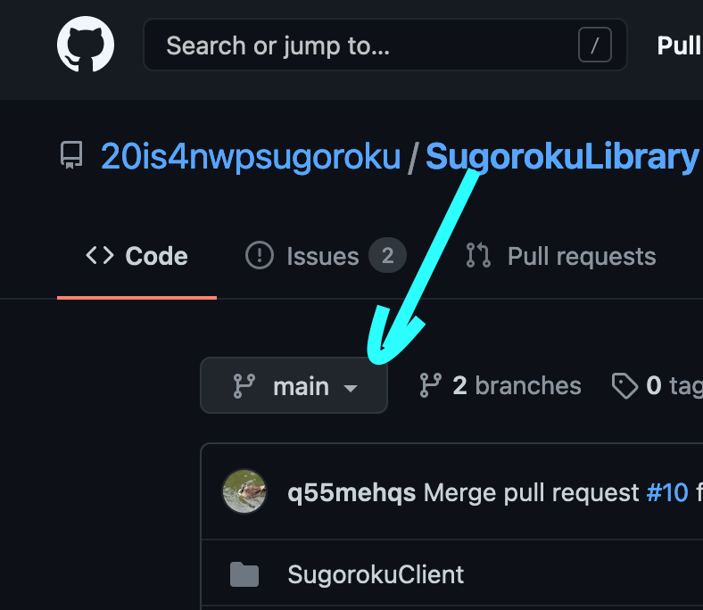
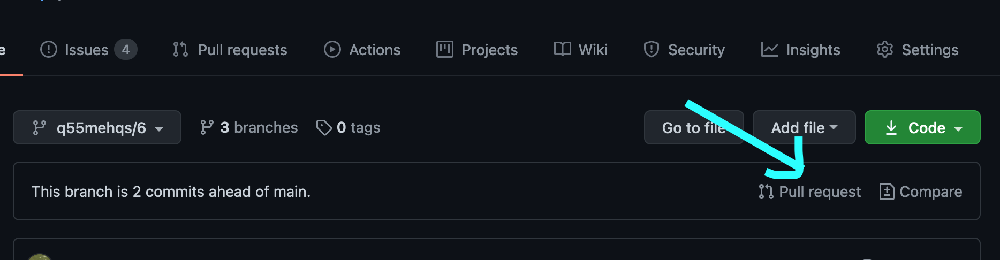
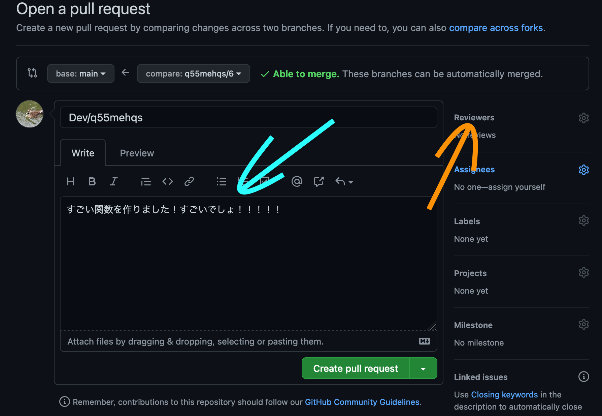

# すごろく (タイトル決まってたっけ)

すごろくしよう

## プロジェクト概要

### SugorokuServer

サーバーサイドについて記載したプロジェクト

(.NET Core 3.1/Cross Platform)

### SugorokuServer.Tests

サーバーサイドの関数についてテストを行うためのプロジェクト

(.NET Core 3.1/Cross Platform)

### SugorokuClient

クライアントサイドについて記載したプロジェクト

## 実行方法

0. リポジトリのクローン

   1. GitHubのアカウントを @q55mehqs に教えて下さい
   2. 20is4nwpsugoroku organizationへの招待のメールを承諾してください
   3. 適当なディレクトリに移動して `git clone https://github.com/20is4nwpsugoroku/SugorokuLibrary.git` コマンドを入力してください

1. SugorokuServer/Program.cs のMainを実行

   - Visual Studioでの実行方法: 開くと左側に表示される再生マークみたいなのをクリックで実行
   - dotnet コマンドでの実行方法: `cd SugorokuServer` → `dotnet build` → `dotnet run`

2. SugorokuClient/Program.cs のMainを実行

   - Serverと実行方法は同様

## プログラムの編集作業

実行方法:0 のリポジトリクローンは済んでいるものとします

自分の編集した内容をメッセージとともに記録する作業を「コミット」と言います。以下コマンドラインでGit操作を行う操作を記載します。VSやVSCodeなど、統合開発環境でGit操作を行う場合はそれぞれの方法に従ってください。

ちなみに、「Git」はファイルのバージョン管理を行うソフトウェア、「GitHub」はGitによって管理されたファイルやディレクトリをクラウド上で管理して「複数人で作業したり自分の編集したファイルを公開できるねー」っていう感じになるサーバーアプリです(超適当説明)

1. プル

   1. サーバー上で他の人が編集した内容を反映させるために「プル」という作業を行います。 `git checkout main` → `git pull main` とコマンドを打ってください

2. ブランチのチェックアウト

   1. 今回は `main` からどこを編集したかをわかりやすくするため、また、編集内容を相互に確認を行えるようにするため「ブランチ」という機能を使います(適当)
   2. `git checkout -b dev/自分のGitHubユーザー名` というコマンドを打ち、ベースとなるブランチから個人的に編集を行うブランチへ「枝分かれ」させます
   3. この中でいくら色々いじっても、`main` ブランチにマージ(枝分かれさせて編集した内容を別のブランチに合流させる操作)されるまで誰にも迷惑をかけません。また、マージ後に不具合が起こった場合でもバグが起こる前に戻せるので、ぜひ積極的にコーディング作業に参加してほしいと思います

3. 編集

   1. ブランチを個人のものに枝分かれさせたので遠慮なく編集してください

4. コミット

   1. コマンドラインでコミットを行う場合は、`git add (編集したファイルのパス)` という内容で「ステージ」(このファイルの変更についてコミットしますという宣言的な) します。すべてのファイルをステージする場合には `git add .` と打ってください。
   2. 1.でaddしたファイルをコミットします。`git commit -m "コミットのメッセージをダブルクォーテーションの中に書きます"` という書式でコミットしてください。

5. プッシュ

   1. `git push origin dev/自分のGitHubユーザー名` というコマンドを打ってGitHubサーバー上に編集した内容をアップロードしてください (Gitでこのアップロードする作業を「プッシュ」といいます)

6. プルリクエストの作成

   0. ここからはGitHubのWebページでの操作です。コミット+プッシュの作業をしばらく進めて、一通り作業が片付いたら「プルリクエスト」という `main` への合流を要請する操作を行います
   1. [このプロジェクトのGitHubページ](https://github.com/20is4nwpsugoroku/SugorokuLibrary) にアクセスしてください
   2. 矢印のところをクリックして「dev/自分のGitHubユーザー名」のブランチを選んでください
   3.  「Pull request」と書かれている場所を選んで「プルリクエスト」作成画面へ移動します
   4.  水色の部分に、チェックアウトしてから変更した内容を書き込み、橙色の矢印の部分に @q55mehqs を指定してください。
   5. 「Create pull request」と書いてある緑色のボタンをクリックしてください
   6. これで枝分かれさせた個人ブランチをメインに合流させる要請を行う作業、「プルリクエスト」は終了です。 @q55mehqs が内容を確認次第 `main` に内容を合流させます。

7. 個人ブランチの削除

   0. ここからは任意ですが、プルリクして `main` に合流した個人ブランチは削除することを強くお薦めします。これは、他の人が更新した `main` の内容から離れて個人ブランチで作業するというのを続けると `main` の変更からどんどん取り残されてしまい、後々合流が大変になるからです。回避する手段をご存知であれば必要ありませんが、ここまでこの手順に従って進めていたという方はブランチを消してしまうのがお手軽だと思います
   1. [GitHubの上がっているプルリクのリスト](https://github.com/20is4nwpsugoroku/SugorokuLibrary/pulls) ページから、6で作成した内容のプルリクエストが消えていること、「Closed」のページに飛んだらそのプルリクが存在していることを確認してください
   2. 自分のコマンドラインまで戻り、`git checkout main` → `git branch -d dev/自分のGitHubユーザー名` を行ってください。

以上です。ここまで行い、さらに作業を続ける場合は1に戻って作業を行ってください。

もし7-1で自分のPRがまだOpenになっている場合は7のステップをパスし、3まで戻り作業をしてください。
